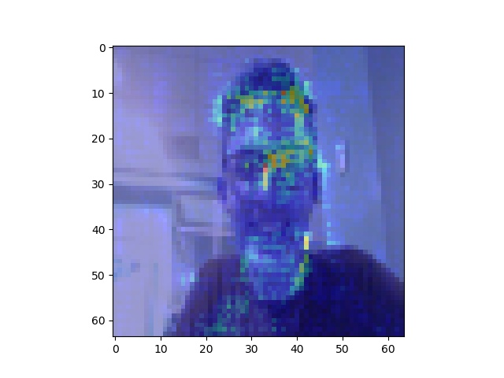

## HackBU2020 ##
# A Candidate Like You
#### Adiel Felsen, Brendan Klayman, Nick Pellegrino, Richard Quinlivan

## Description
A Candidate Like You is a dual neural network website aim'ed at finding you the presidential candidate that is the most like you, however you determine that.

## Finding most like-minded candidate:
 - A ChatBot prompts conversation with the user about their political views
 - Two neural networks analyze speech patters, language use, and vocabulary to create an opinion profile on the user
 - Once enough data has been gathered, the user is shown the politician that best matches their custom opinion profile

## Finding most look-alike candidate:
 - A Convolutional Neural Network (CNN) is trained on 135 images of each presidential candidate with the goal of classifying the candidate
 - The CNN is tested on 15 images of each candidate
 	- Achieved ~85% training accuracy and ~62% testing accuracy
 - The CNN outputs the candidate who looks like you the most, and a saliency map that represents what the neural network is looking at

*Example of image saliency*

